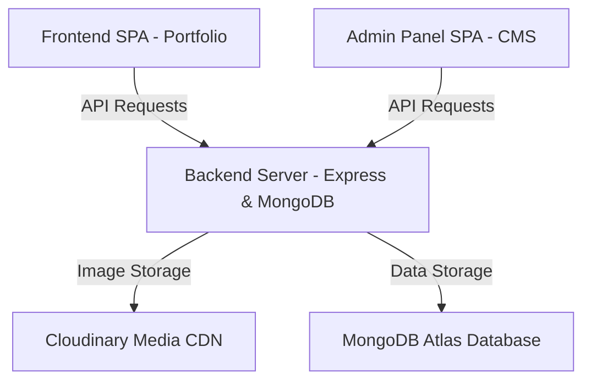

# Heven Studios & HFM Freelance Manager - Deployment Guide

This repository contains a full-stack, production-ready premium developer agency portfolio and client management platform.

## Architecture Structure



* **`/backend`**: Node.js & Express REST API communicating with MongoDB Atlas.
* **`/frontend`**: Premium responsive agency portfolio website built using React, Vite, Tailwind CSS, and Framer Motion.
* **`/admin`**: Studio Content Management System (CMS) & Client Portal admin panel.

---

## 1. Environment Configuration

Copy `.env.example` templates to `.env` in respective directories:

### Backend Configuration (`/backend/.env`)
Ensure the following variables are configured:
* `NODE_ENV`: Set to `production`.
* `PORT`: Target port (defaults to `5000`).
* `MONGO_URI`: Production MongoDB Atlas connection URI.
* `JWT_SECRET`: Secure cryptographic key for signature signing.
* `EMAIL_HOST` / `EMAIL_PORT` / `EMAIL_USER` / `EMAIL_PASS`: SMTP server credentials for client emails.
* `CLOUDINARY_CLOUD_NAME` / `CLOUDINARY_API_KEY` / `CLOUDINARY_API_SECRET`: Media upload assets keys.

### Client SPAs Configuration (`/frontend/.env` and `/admin/.env`)
Configure the target production API endpoint:
* `VITE_API_URL`: `https://your-backend-api-domain.com/api`

---

## 2. Production Build Verification

Build static client assets into optimized `dist/` folders:

```bash
# Build Public Portfolio Frontend
cd frontend
npm install
npm run build

# Build Admin Panel CMS
cd ../admin
npm install
npm run build
```

---

## 3. Hosting Recommendations

### Backend REST API
* Host on **Render**, **Railway**, **Heroku**, or a custom VPS using PM2.
* Set the Environment Variables inside the host settings dashboard.
* Commands:
  * Install: `npm install`
  * Start command: `node index.js`

### Frontend & Admin Panels
* Since both are built as Static Single Page Applications (SPAs), host them on CDNs like **Vercel**, **Netlify**, or **AWS Amplify**.
* **SPA Routing Catch-all rule**: Ensure rewrite rules are configured to redirect all routes to `index.html` to allow React Router to handle page history:
  * **Vercel (`vercel.json`)**:
    ```json
    {
      "rewrites": [{ "source": "/(.*)", "destination": "/index.html" }]
    }
    ```
  * **Netlify (`_redirects`)**:
    ```text
    /*   /index.html   200
    ```
