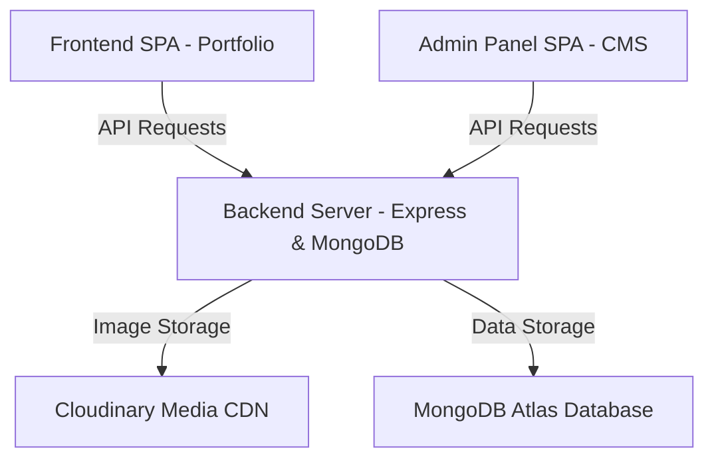

# Heven Studios & HFM Freelance Manager - Deployment Guide

This repository contains a full-stack, production-ready premium developer agency portfolio and client management platform.

## Architecture Structure



* **`/backend`**: Node.js & Express REST API communicating with MongoDB Atlas.
* **`/frontend`**: Premium responsive agency portfolio website built using React, Vite, Tailwind CSS, and Framer Motion.
* **`/admin`**: Studio Content Management System (CMS) & Client Portal admin panel.

---

## 1. Environment Configuration

Copy `.env.example` templates to `.env` in respective directories:

### Backend Configuration (`/backend/.env`)
Ensure the following variables are configured:
* `NODE_ENV`: Set to `production`.
* `PORT`: Target port (defaults to `5000`).
* `MONGO_URI`: Production MongoDB Atlas connection URI.
* `JWT_SECRET`: Secure cryptographic key for signature signing.
* `EMAIL_HOST` / `EMAIL_PORT` / `EMAIL_USER` / `EMAIL_PASS`: SMTP server credentials for client emails.
* `CLOUDINARY_CLOUD_NAME` / `CLOUDINARY_API_KEY` / `CLOUDINARY_API_SECRET`: Media upload assets keys.

### Client SPAs Configuration (`/frontend/.env` and `/admin/.env`)
Configure the target production API endpoint:
* `VITE_API_URL`: `https://your-backend-api-domain.com/api`

---

## 2. Production Build Verification

Build static client assets into optimized `dist/` folders:

```bash
# Build Public Portfolio Frontend
cd frontend
npm install
npm run build

# Build Admin Panel CMS
cd ../admin
npm install
npm run build
```

---

## 3. Hosting Recommendations (Vercel Ready)

All three projects are fully optimized and configured for native deployment on **Vercel**:

### 1. Backend REST API (`/backend`)
* Deploy as a **Node Serverless Function** project.
* Vercel will automatically read `backend/vercel.json` and route all requests to the Express application via the `@vercel/node` builder.
* Set all environment variables (e.g. `MONGO_URI`, `JWT_SECRET`, `CLOUDINARY_CLOUD_NAME`, `CLOUDINARY_API_KEY`, `CLOUDINARY_API_SECRET`, etc.) in the Vercel project Settings -> Environment Variables.

### 2. Frontend Portfolio (`/frontend`) and Admin Portal (`/admin`)
* Deploy both as separate static SPA projects.
* Build settings to use:
  * **Build Command**: `npm run build`
  * **Output Directory**: `dist`
  * **Environment Variable**: Set `VITE_API_URL` to point to your live backend endpoint.
* Vercel will read the local `vercel.json` in each directory to ensure smooth React Router reloads without 404 errors.

